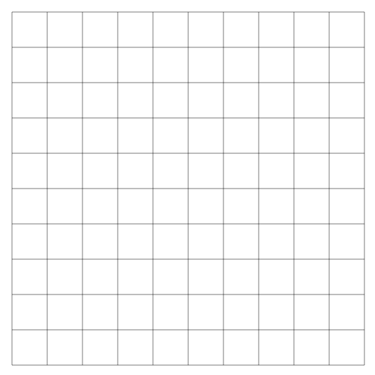
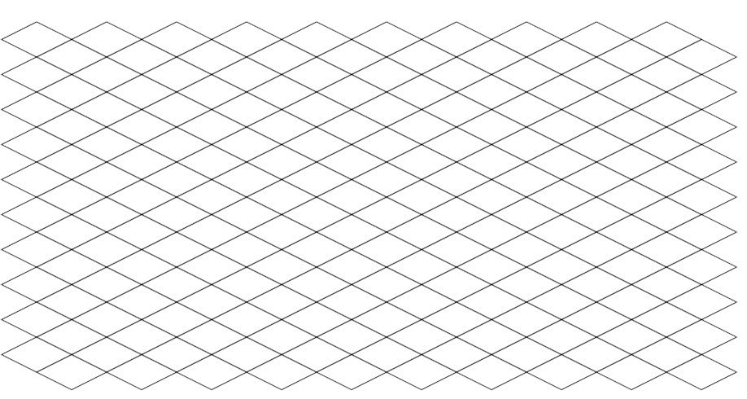

# Welcome to Snap

  Snap is a framework on top of SFML.NET proving a lot of utility to make a 2D game.
  Written in C# .NET Core 3.1, this library is multiplateform.
  * SFML : https://www.sfml-dev.org/download/sfml.net/

# Grids

* For each grid, there are events dealing with user inputs 
```csharp
public delegate void MouseEvent(T cell);
public event MouseEvent OnMouseEnter;
public event MouseEvent OnMouseLeave;
public event MouseEvent OnMouseRightClick;
public event MouseEvent OnMouseLeftClick;

* There is two rendering mode, optimized and unoptimized mode. 
  this parameter can be passed in the Grid constructor, its default value is false.
  In the optimized mode, the events will not be processed, and the rendering will be done using a vertex buffer. 
  The appearance of the cells will not be editable. Otherwise, each cell will be represented by ```SFML.Graphics.ConvexShape ```. 

```
## Orthogonal Grid

* Namespace : ```Snap.Graphics.Grids.GridOrthogonal```

* Represents a two-dimensional orthogonal grid. Used to map tiles in a side scroller or top down game. 
  The grid is rendered using a VertexBuffer, this allows to gain a lot in performance 



## Isometric Grid

* Namespace : ```Snap.Graphics.Grids.GridIsometric```

* Represents an isometric grid. Also rendered using VertexBuffer.

